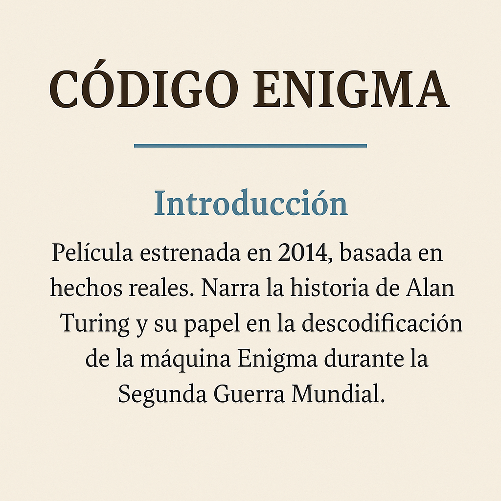

# Guía para presentación.

## Estructura sugerida de laas diapositivas.

1. Portada: Título del trabajo + nombre de los integrantes.
2. Introducción: presentación general de la película.
3. Personaje principal y el resto del conjunto: ¿Quiénes son?
4. Contexto: Explicación del momento histórico y los avances tecnológicos implicados.
5. Reflexión personal: Qué aprendieron, qué les impactó o llamó la atención.
6. Conclusión: Cierre del trabajo y breve resumen.

## Consejos para el diseño visual.

**Colores**

- Elegir una paleta de 3 o 4 colores como máximo.

- Usar fondos sobrios (gris, negro, azul oscuro).

- Contrastar bien el texto con el fondo (texto blanco o claro sobre fondo oscuro, y viceversa).

- Evitar colores demasiado brillantes o que dificulten la lectura.

**paleta de colores**

**Tipografía**

- Utilizar letras simples y claras. Recomendadas:

 - Títulos: Montserrat, Oswald.

 - Texto: Arial, Roboto, Open Sans, Calibri.

- No usar más de 2 tipos de letra diferentes en toda la presentación.

- Evitar tipografías decorativas o difíciles de leer.

## Recomendaciones generales

1. No sobrecargar las diapositivas con texto. Usar frases cortas o palabras clave.

2. Incluir imágenes relevantes y de buena calidad.

3. Asegurarse de que el video se vea correctamente y esté relacionado con el contenido.

4. Cuidar la ortografía y la coherencia del texto.

5. Si la presentación es oral, practicar previamente.

## Imagen de ejemplo de diapositiva.

